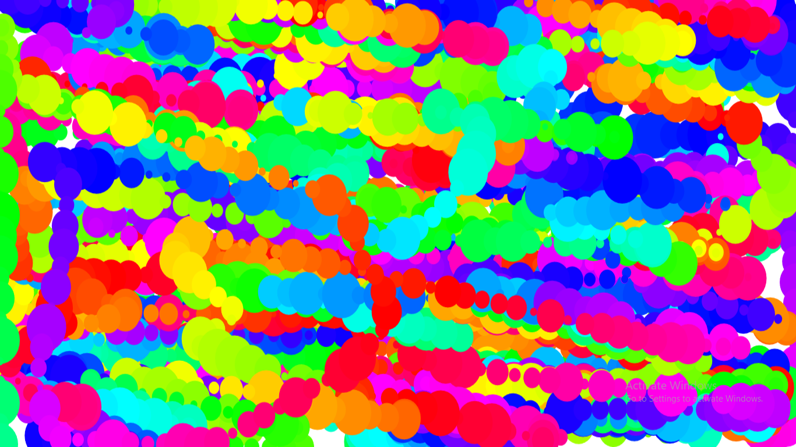

# Chromatic-Chaos

This project is a dynamic and interactive web application called "Chromatic Chaos." The application utilizes the [paperjs.org](http://paperjs.org/) library to create an engaging visual experience.

The "Chromatic Chaos" project combines mouse movement tracking, randomized circle creation, and dynamically changing colors to create an interactive visual experience on the canvas.

